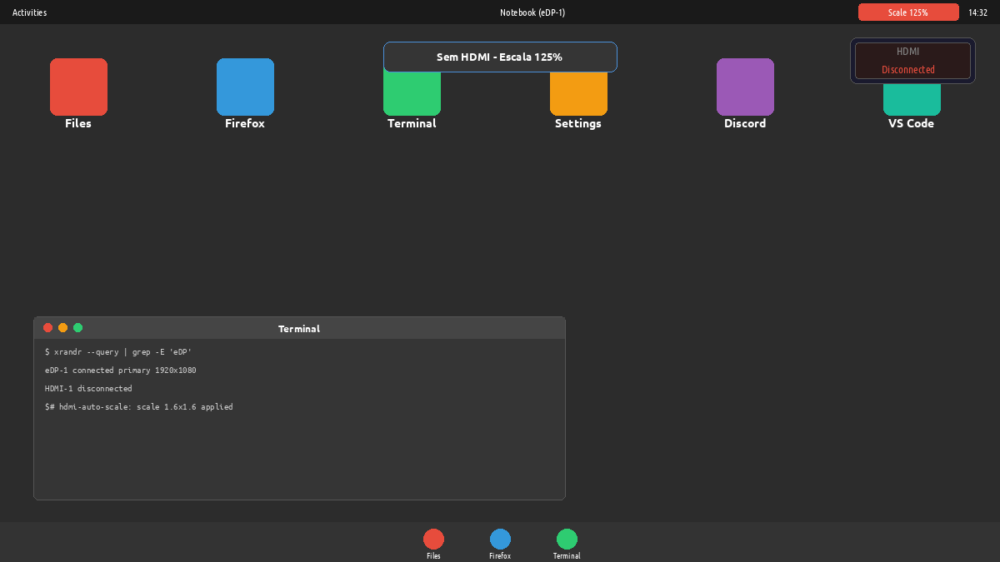

# hdmi-auto-scale

Ajuste automático de escala do display do notebook ao plugar/desplugar um monitor HDMI externo — para **GNOME no X11** com fractional scaling.



Testado em um **Dell Latitude 5420** (Intel Core i5 11ª geração, 24 GB RAM, 14" FHD) rodando **Pop!_OS 22.04** com GNOME no X11.

## Por que este projeto?

O GNOME no X11 com fractional scaling (`x11-randr-fractional-scaling`) exige ajuste manual da escala toda vez que você pluga ou despluga um monitor externo. Se você usa 125% na tela do notebook para legibilidade, mas precisa de 100% quando espelha ou estende a tela com um monitor maior, precisa abrir Configurações > Telas toda vez.

Este projeto automatiza isso monitorando eventos de hotplug HDMI via `inotifywait` e aplicando o fator de escala correto com `xrandr` instantaneamente.

## Como funciona

```
┌──────────────────────────────────────────────────────────┐
│  inotifywait monitora /sys/class/drm/card*-HDMI-*/status │
│                            │                             │
│               ┌────────────┴────────────┐                │
│               │  HDMI conectado?         │                │
│               └────────────┬────────────┘                │
│                      ┌─────┴─────┐                         │
│                    SIM          NÃO                         │
│                     │            │                          │
│             scale 1x1      scale 1.6x1.6                   │
│             (100%)         (GNOME "125%")                  │
└──────────────────────────────────────────────────────────┘
```

O fractional scaling de 125% do GNOME no X11 usa `xrandr --scale 1.6x1.6` (fator de transformação 2/1.25), que produz uma resolução virtual de 3072×1728 em um painel de 1920×1080. Isso **não** é 1.25×1.25 — o compositor Mutter aplica uma transformação diferente internamente.

## Requisitos

- GNOME no **X11** (Wayland trata fractional scaling de forma diferente)
- `xrandr` (geralmente já instalado)
- `inotify-tools` (o script de instalação cuida disso no Debian/Ubuntu)
- Bash >= 4

## Instalação rápida

```bash
git clone https://github.com/lucascosm3/hdmi-auto-scale.git
cd hdmi-auto-scale
./install.sh
```

O script de instalação vai:

1. Instalar `inotify-tools` via apt, se necessário
2. Copiar `hdmi-scale-monitor.sh` para `~/.local/scripts/`
3. Copiar e configurar o serviço systemd de usuário
4. Habilitar e iniciar o serviço imediatamente

## Instalação manual

```bash
# Instalar dependências
sudo apt install inotify-tools

# Copiar o script
mkdir -p ~/.local/scripts
cp hdmi-scale-monitor.sh ~/.local/scripts/
chmod +x ~/.local/scripts/hdmi-scale-monitor.sh

# Copiar o serviço systemd
mkdir -p ~/.config/systemd/user/
cp hdmi-scale-monitor.service ~/.config/systemd/user/

# Substituir %h pelo caminho do seu home no arquivo de serviço
sed -i "s|%h|$HOME|g" ~/.config/systemd/user/hdmi-scale-monitor.service

# Habilitar e iniciar
systemctl --user daemon-reload
systemctl --user enable --now hdmi-scale-monitor.service
```

## Configuração

Toda a configuração é feita via variáveis de ambiente, que você pode definir em um override do systemd:

| Variável | Padrão | Descrição |
|---|---|---|
| `INTERNAL_DISPLAY` | `eDP-1` | Nome do conector do display interno do notebook |
| `SCALE_WITHOUT_HDMI` | `1.6x1.6` | Escala sem monitor externo (GNOME 125%) |
| `SCALE_WITH_HDMI` | `1x1` | Escala com HDMI conectado (100%) |

### Descobrindo o nome do seu display

```bash
xrandr --query | grep -E "^eDP|^DP|^LVDS"
```

### Sobrescrevendo os padrões

```bash
# Criar um override do systemd
systemctl --user edit hdmi-scale-monitor.service
```

Adicione suas preferências:

```ini
[Service]
Environment="INTERNAL_DISPLAY=eDP-1"
Environment="SCALE_WITHOUT_HDMI=1.6x1.6"
Environment="SCALE_WITH_HDMI=1x1"
```

### monitors.xml (opcional)

Para uma experiência limpa no GNOME, você também deve configurar `~/.config/monitors.xml` com os layouts desejados. Veja [`monitors.xml.example`](monitors.xml.example) para um template — substitua os valores de vendor/product/serial pelos seus (execute `xrandr --query` para encontrá-los).

## Monitoramento e Logs

```bash
# Verificar status do serviço
systemctl --user status hdmi-scale-monitor.service

# Acompanhar logs em tempo real
tail -f ~/.local/state/hdmi-auto-scale.log

# Ver journal
journalctl --user -u hdmi-scale-monitor.service -f
```

## Desinstalação

```bash
./uninstall.sh
```

Ou manualmente:

```bash
systemctl --user disable --now hdmi-scale-monitor.service
rm ~/.local/scripts/hdmi-scale-monitor.sh
rm ~/.config/systemd/user/hdmi-scale-monitor.service
systemctl --user daemon-reload
```

## Resolução de problemas

### A escala não é aplicada no hotplug

- Verifique se o serviço está rodando: `systemctl --user status hdmi-scale-monitor.service`
- Verifique o log: `cat ~/.local/state/hdmi-auto-scale.log`
- Certifique-se de que está no X11, não Wayland: `echo $XDG_SESSION_TYPE` deve retornar `x11`
- Se o HDMI aparece em outra placa, verifique: `ls /sys/class/drm/card*-HDMI-*/status`

### O GNOME sobrescreve minhas configurações de escala

- O script reage depois que o GNOME aplica suas próprias configurações. Pode haver um flash breve enquanto o GNOME ajusta a escala, e então este script corrige.
- Para uma solução persistente, configure `~/.config/monitors.xml` com as escalas desejadas (veja o arquivo de exemplo).

### Display errado detectado

- Defina `INTERNAL_DISPLAY` com o nome correto do conector (verifique com `xrandr --query`).

### A escala 1.6x1.6 parece errada

- O fractional scaling "125%" do GNOME no X11 usa escala 1.6 (que é 2/1.25), não 1.25. Se você usa outra escala fracionária, ajuste `SCALE_WITHOUT_HDMI` conforme a tabela:

  | Configuração GNOME | Escala xrandr |
  |---|---|
  | 100% | 1x1 |
  | 125% | 1.6x1.6 |
  | 150% | 1.33x1.33 |
  | 175% | 1.14x1.14 |
  | 200% | 1x1 (dobra sozinho) |

## Funcionamento interno

1. **Na inicialização**, o script verifica imediatamente todos os arquivos de status HDMI e aplica a escala correta.
2. **inotifywait** monitora todos os arquivos `/sys/class/drm/card*-HDMI-*/status` por mudanças (eventos de hotplug via subsistema DRM do kernel).
3. **Na mudança**, um delay de debounce de 2 segundos permite que o kernel/hardware estabilize, então a escala é aplicada via `xrandr`.
4. **O script roda como um serviço systemd de usuário**, então tem acesso ao display X11 e Xauthority do usuário.

## Hardware compatível

Desenvolvido e testado em:

- **Dell Latitude 5420** (Intel Core i5 11ª geração, 24 GB RAM, 14" FHD 1920×1080)
- **LG HDR WFHD** (2560×1080 ultrawide via HDMI)

Deve funcionar em qualquer configuração GNOME + X11 com display de notebook (eDP) e saída HDMI. Se funcionar (ou não) no seu hardware, abra uma issue ou PR para adicionar a esta lista.

## Contribuindo

Issues e pull requests são bem-vindos. Se funcionar (ou não) no seu hardware, deixe um comentário.

## Licença

[MIT](LICENSE)